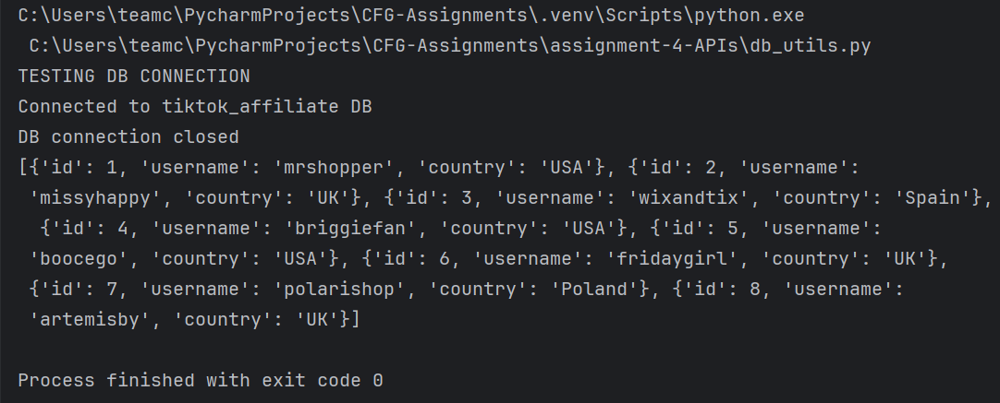

# 🛍️ TT Shop Affiliates API

A backend simulation project inspired by the **TikTok Shop Affiliate Programme**, designed to track product videos, affiliate earnings, and sales via a **Flask API** and **MySQL database**.

> 🚨 **Note:** All data is fictional and used solely for educational purposes as part of the Code First Girls Foundation Programme in Data & Software Engineering.

---

## 📌 Project Summary

This project demonstrates how TikTok shop affiliates earn commission by creating content that promotes products. The system enables CRUD operations and business logic to calculate total earnings based on views and sales

---

## 🧠 What I Learned

Through this project, I gained hands-on experience in:

- ✅ Designing and manipulating relational databases using **MySQL**
- ✅ Writing clean, modular **Python** backend code
- ✅ Creating RESTful **APIs using Flask**
- ✅ Working with **db-utils** for database operations
- ✅ Handling **JSON** requests/responses
- ✅ Simulating real-world business logic (commission calculations)
- ✅ Testing and debugging API endpoints

---

## 🧪 Tech Stack


---

## 🚀 Installation & Setup

### 1. 🔧 Install Requirements

Install required Python packages:

```bash
pip install flask requests
```


### 2. Create database "tiktok_affiliates" in Mysql
#### Use the data present in the file: ```tiktok_affiliate_DB.sql```
Two tables can then be created:
 - ```affiliates``` 
 - ```videos``` 


### 3. Update ```config.py``` with your MySQL credentials.
>[!NOTE] Ensure you have used your own mySQL password

```bash 
USER = "root"
PASSWORD = "your_password"
HOST = "localhost"
DATABASE = "tiktok_affiliates"
```

### 4. Run the ```db_utils.py``` and check that it is connecting to MySql server.
Run the following commands to retrieve data from the database to check connection to the MySql server.
```bash
if __name__ == "__main__":
    print("TESTING DB CONNECTION")
    print(fetch_all_affiliates())
 ```



### 5. Run the Flask API: ```ttvideo_api.py```


The API will run on ```http://127.0.0.1:5000```.
>[!NOTE] Ensure MySQL database is running before starting the Flask app 


### 6. API Endpoints

| Method | Endpoint          | Description                                                          |
|:-------|:------------------|:---------------------------------------------------------------------|
| GET    | /affiliates"      | Retrieve all affiliates                                              |
| GET    | /videos/{country} | Fetch all videos by country. Replace <country> with the country name |
| GET    | /earnings         | Fetch calculated total earnings/comissions for each video            |
| POST   | /add              | Adds new video dictionary to the video table                         |


## Client-Side Interaction -  main.py


#### To interact with the API, run the ```main.py``` file which provides a command-line interface for the user to:

- View all affiliates.
- View videos by country.
- View total earnings and the top earning video
- Add a new video to the database.

### Run the following options to start the client:

Examples 

### 1. View all affiliates
```bash
Enter your choice: 1
```

### 2. View videos by country - sample input
```bash
Enter your choice: 2
Enter name of country from this list ['USA', 'UK', 'Poland', 'Spain']: UK
```

### 3. View earnings for each video and the top earning video
```bash
Enter your choice: 3
```
### 4. Add New Video - sample input
```bash
Enter your choice: 4 
Affiliate_id: 1 
Name of product: White joggers 
Number of views: 345  
Commission per sale: 1.25 
Number of sales: 30 
```


Thank you!
